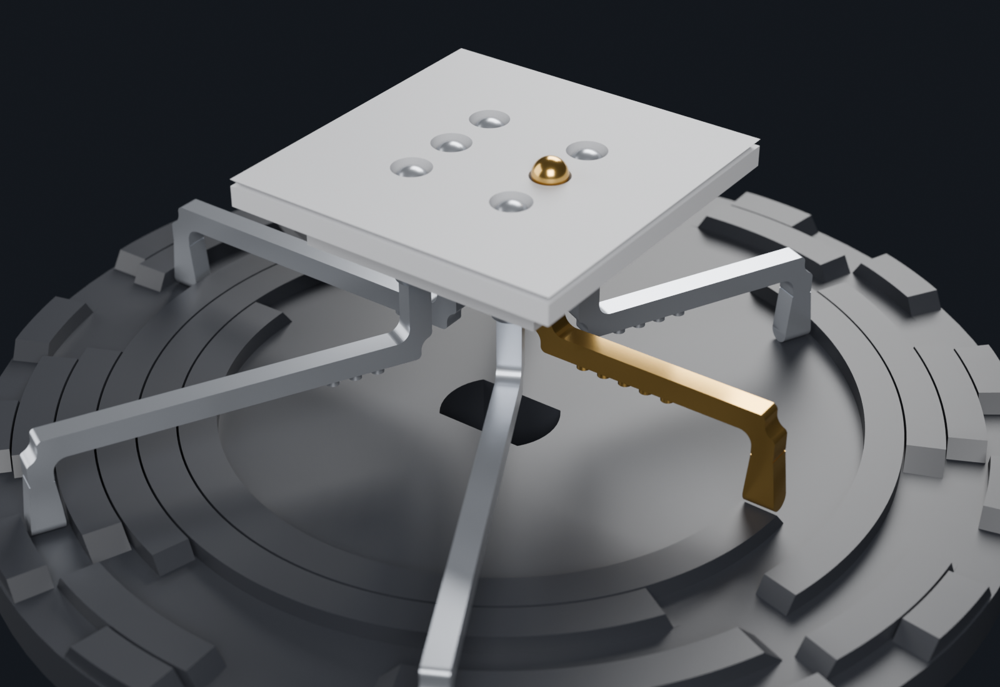
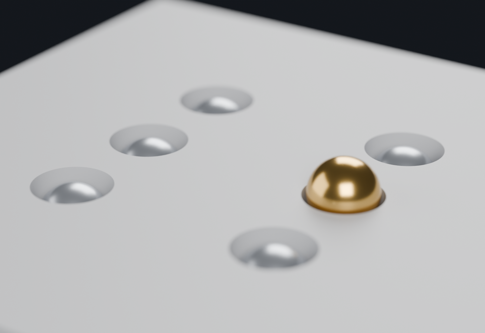

# Braillix

Braillix is a refreshable braille cell. It shows one braille character at a time,
and it changes that character on command. A single stepper motor moves all six
dots. The parts are 3D printed. The controller is an ESP32.

**Live mechanism simulator: https://mridulnegi2005.github.io/Capstone/**

The simulator runs the real cam profile. It reads the same numbers as the CAD
files. A motion that the printed cam cannot make is a motion the simulator cannot
show.

---

## What the device does

A braille character uses a cell of six dots. Each dot is up or down. Six dots give
64 different patterns. A reader identifies the character by touch.

Braillix raises and lowers those six dots on demand. A teacher sets a letter, and
a student reads it. The device then changes to the next letter.

Commercial refreshable braille displays cost between 2,000 and 6,000 US dollars.
They use piezoelectric actuators. Each dot needs its own actuator, and each
actuator is expensive. Braillix uses one motor and a shaped disc instead.

---

## How the mechanism works

The heart of the device is a **cam disc**. A cam is a shaped part that converts
rotation into linear movement.

### The disc

The disc carries six circular **tracks**. One track drives one dot. Each track has
high sections and low sections around its circumference.

The disc turns to 64 angular positions. Each position is one **slice**. Each slice
carries one of the 64 dot patterns.

### The follower

A **linkage** rests on each track. The linkage is a rigid crank. Its **foot** sits
on the track. Its other end carries the braille dot.

*The cam disc below, the six linkages above it, and the reading surface on top.
One linkage is gold. Its foot stands on a high section of its track, so its dot is
raised. The other five are down. The comb and the enclosure are left out of this
view.*

When the foot meets a high section, the linkage moves up. The dot rises above the
reading surface. When the foot meets a low section, the linkage moves down. The
dot becomes flush with the surface.

A return spring holds each linkage down against the disc.

*The reading surface, seen close. Five dots are down and sit below the surface, so
a finger feels only the recesses. The sixth dot stands 0.8 mm proud. A reader
feels that difference, and that difference is the character.*

### One motor for six dots

The six tracks turn together, because they are on one disc. One rotation of the
motor therefore sets all six dots at once. This removes the need for six
actuators.

The motor is a 28BYJ-48 stepper. It makes 4096 steps for each revolution. One
slice is 64 steps. The firmware turns the motor to the slice that holds the wanted
pattern.

### The guide

The foot rests on the disc. It does not clamp to it. A rotating disc therefore
drags the linkage sideways. A **comb** stops this. The comb is a fixed plate above
the disc. It has one closed pocket for each foot. The linkage slides up and down
in its pocket, and it cannot turn.

### Gray order

The slices do not carry the patterns in counting order. They carry them in **Gray
order**. In Gray order, two neighbour slices differ by exactly one bit. Only one
dot therefore moves for each step of the disc.

This gives two results. The dots do not flicker as much between letters. The motor
also lifts one dot at a time, not six, so it needs less torque.

The cam, the firmware and the simulator all share this order. All three must agree.

### Homing

A magnet sits in the underside of the disc. A hall sensor sits in the base plate
below it. The controller turns the disc until the sensor finds the magnet. That
angle is position zero. The controller counts steps from there.

---

## Repository layout

    Capstone/
    |
    +-- cad/                        the design
    |   +-- scad/                   OpenSCAD source, 35 files. This IS the design.
    |   |   +-- mech_layout.scad        every shared dimension lives here
    |   |   +-- braille_cam.scad        the cam disc and its six tracks
    |   |   +-- linkage.scad            the six followers
    |   |   +-- linkage_comb.scad       the guide that stops them turning
    |   |   +-- outer_box.scad          the enclosure
    |   |   +-- base_plate.scad         holds the motor and the cam
    |   |   +-- mid_plate.scad          the motor shelf
    |   |   +-- top_plate.scad          the reading surface
    |   |   +-- dot_insert.scad         resin tile, six dot holes
    |   |   +-- esp32_pod_*.scad        housing for the controller
    |   +-- stl/                    meshes exported from scad/. Print these.
    |   +-- dxf/                    2D outlines
    |   +-- models/                 third-party component models
    |
    +-- firmware/                   what runs on the board
    |   +-- braille_cell/
    |   |   +-- braille_cell.ino        the current sketch
    |   +-- breadboard_test/            earlier bring-up sketch
    |   +-- braille_mapping.py          text to dot patterns
    |   +-- braille_converter.py
    |
    +-- sim/                        the simulator
    |   +-- 3d/
    |   |   +-- index.html              the page
    |   |   +-- app.js                  cam maths and animation
    |   |   +-- braillix.glb            the 3D model
    |   |   +-- vendor/                 a local copy of Three.js
    |   +-- braillix_params.json        the CAD-to-software bridge
    |   +-- extract_params.py           writes that file from the OpenSCAD source
    |
    +-- printing/                   getting parts made
    |   +-- orca/                       slicer profiles and the slice script
    |   +-- gcode_kobra_neo_checked/    released G-code
    |   +-- gcode_HOLD_*/               G-code held back, fit not yet proven
    |
    +-- docs/                       the engineering record, 32 notes
    |   +-- BRAILLE_READABILITY.md      measured against braille standards
    |   +-- MEASUREMENTS_NEEDED.md      every measurement, in plain words
    |   +-- BREADBOARD_STEP_BY_STEP.md  the wiring, one wire at a time
    |   +-- PRINT_DAY_MONDAY.md         the print procedure
    |   +-- MULTICELL_ARCHITECTURE.md   how to reach more than one cell
    |   +-- img/                        images used by this README
    |
    +-- tools/
    |   +-- validate_print_assets.py    checks meshes and G-code before release
    |
    +-- renders/                    images, and the scripts that make them
    +-- print_batch/                files prepared for a print shop
    +-- _archive/                   superseded work, kept for history

---

## Key files

### Design

The tree above names each part. Three of them need a word of explanation.

- **`cad/scad/mech_layout.scad`** is the single source of truth. Dot positions, the
  vertical stack, spring sizes and arm geometry live here, and every other file
  includes it. Change a number here, and every part follows. A dimension copied
  into a second file has caused real errors in this project, so nothing is copied.
- **`cad/scad/linkage.scad`** builds all six followers at once. Each one has a
  different arm length, because each foot sits on a different track.
- **`cad/scad/dot_insert.scad`** builds a small resin tile. It carries the six dot
  holes and the six spring pockets. Those features are too fine for an FDM printer,
  so they move out of the top plate and into one small part.

### Firmware

- **`firmware/braille_cell/braille_cell.ino`** is the current sketch. Type a letter
  into the Serial Monitor, and the cam turns to that letter.
- **`firmware/braille_mapping.py`** and **`braille_converter.py`** convert text to
  dot patterns on a computer.

### Simulator

- **`sim/3d/index.html`** and **`sim/3d/app.js`** are the simulator. The app reads
  the cam profile from the parameter file, and drives a 3D model with it.
- **`sim/braillix_params.json`** is the bridge between the CAD and the software.
  `sim/extract_params.py` writes it from the OpenSCAD source.

### Checks

- **`tools/validate_print_assets.py`** checks the printable files. It confirms that
  each mesh is closed, and that each G-code file matches the mesh it came from.
- **`printing/orca/slice_kobra_neo_checked.sh`** makes the G-code, and runs those
  checks.

### Documentation

The `docs/` directory holds the engineering record. These files are the most
useful:

- `BRAILLE_READABILITY.md` compares the design against braille standards.
- `MEASUREMENTS_NEEDED.md` lists every measurement, in plain words.
- `BREADBOARD_STEP_BY_STEP.md` gives the wiring, one wire at a time.
- `PRINT_DAY_MONDAY.md` gives the print procedure.
- `MULTICELL_ARCHITECTURE.md` studies how to reach more than one cell.

---

## Hardware

| Part | Detail |
|---|---|
| Controller | ESP32 DevKit, 30 pins, USB-C |
| Motor | 28BYJ-48 stepper, 5 V |
| Driver | ULN2003 module |
| Sensor | A3144 hall sensor, for homing |
| Power | 5 V supply, or the USB cable for a bench test |
| Printed parts | PETG for the enclosure, resin for the cam and the linkages |

---

## Build and run

### 1. Connect the electronics

Disconnect all power first. Then make these connections.

| From | To |
|---|---|
| ESP32 `GPIO 18` | ULN2003 `IN1` |
| ESP32 `GPIO 19` | ULN2003 `IN2` |
| ESP32 `GPIO 21` | ULN2003 `IN3` |
| ESP32 `GPIO 22` | ULN2003 `IN4` |
| ESP32 `GND` | ULN2003 `-` |
| ESP32 `5V` | ULN2003 `+` |
| Hall sensor `AO` | ESP32 `GPIO 34` |
| Hall sensor `VCC` | ESP32 `3V3` |
| Hall sensor `GND` | ESP32 `GND` |

Push the motor plug into the socket on the ULN2003 module. The plug fits one way.

Two warnings apply:

- The ground connection between the ESP32 and the driver is essential. Without it,
  the driver cannot read the control signals.
- Connect the hall sensor to `3V3`, not to `5V`. A 5 V signal on `GPIO 34` damages
  the ESP32.

An external 5 V supply is optional for a bench test. The USB cable gives enough
current for one motor. Do not connect an external supply and the USB cable to the
same rail.

### 2. Prepare the Arduino IDE

1. Install the Arduino IDE.
2. Open **File > Preferences**.
3. Add this URL to **Additional boards manager URLs**:
   `https://espressif.github.io/arduino-esp32/package_esp32_index.json`
4. Open **Tools > Board > Boards Manager**.
5. Search for `esp32`. Install the Espressif package.
6. Open **Tools > Manage Libraries**.
7. Search for `AccelStepper`. Install it.

### 3. Set the board options

Open the **Tools** menu. Set these options.

| Option | Value |
|---|---|
| Board | ESP32 Dev Module |
| Port | your COM port, or your `/dev/tty` port |
| Partition Scheme | **Huge APP (3MB No OTA/1MB SPIFFS)** |

The partition scheme matters. The default scheme gives the sketch 1.25 MB only.
The sketch needs more, because it includes the WiFi stack and the Bluetooth stack.
The `Huge APP` scheme gives 3 MB. The sketch does not use a filesystem, and it does
not use wireless upload, so this scheme costs nothing.

### 4. Flash the firmware

1. Open `firmware/braille_cell/braille_cell.ino`.
2. Press **Upload**.
3. Hold the **BOOT** button if the upload stops at `Connecting...`.
4. Open **Tools > Serial Monitor**.
5. Set the speed to **115200 baud**.
6. Set the line ending to **Newline**.

### 5. Drive the cell

The board searches for the homing magnet at start. It reports that no magnet is
present when no disc is on the shaft. This report is correct, and motion still
works.

Type a letter or a word, and press Enter. The motor turns to each character.

These commands are also available:

| Command | Action |
|---|---|
| `!spin` | Turn one full revolution |
| `!home` | Search for the homing magnet again |
| `!zero` | Set the current position to zero |
| `!hall` | Print the hall sensor reading |
| `!speed V A` | Set the maximum speed and the acceleration |
| `!gap MS` | Set the pause between letters |

The sketch also defines an access point name and password near the top of the
file. Change both values before any public demonstration.

### 6. Rebuild the printable files

Install OpenSCAD to change the design. Then export a part:

    openscad -o cad/stl/braille_cam.stl cad/scad/braille_cam.scad

Check every printable file:

    python tools/validate_print_assets.py --skip-gcode

### 6b. Rebuild the images in this file

Both pictures come from the CAD, not from a drawing program. Regenerate them after
any change to the mechanism, or they become wrong without any warning.

    cd renders
    openscad -D only=\"cam\"           -o /tmp/b/cam.stl           readme_mechanism.scad
    openscad -D only=\"linkages_down\" -o /tmp/b/linkages_down.stl readme_mechanism.scad
    openscad -D only=\"linkage_up\"    -o /tmp/b/linkage_up.stl    readme_mechanism.scad
    openscad -D only=\"insert\"        -o /tmp/b/insert.stl        readme_mechanism.scad

    blender -b -P blender_mechanism.py -- /tmp/b ../docs/img/mechanism.png 220 0 hero
    blender -b -P blender_mechanism.py -- /tmp/b ../docs/img/dot_raised.png 220 0 dot

The Blender step uses the GPU if one is present. It falls back to the processor
otherwise, and takes longer.

### 7. Run the simulator on your own machine

The simulator needs a web server. A browser blocks the 3D model over a `file://`
address.

    cd sim/3d
    python -m http.server 8777

Then open `http://localhost:8777/`.

---

## Status

The mechanism is under test. The motor, the driver, the wiring and the character
encoding all work. The cam and the linkages are in revision. The `docs/` directory
records each open item, and each measurement that supports it.
