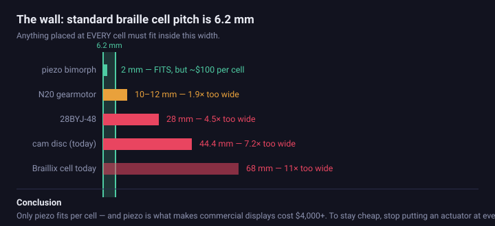
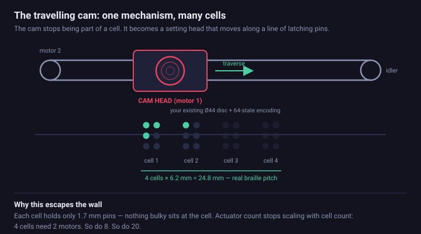
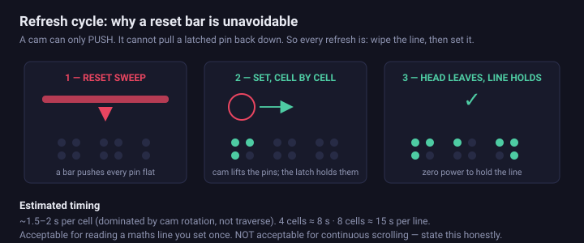
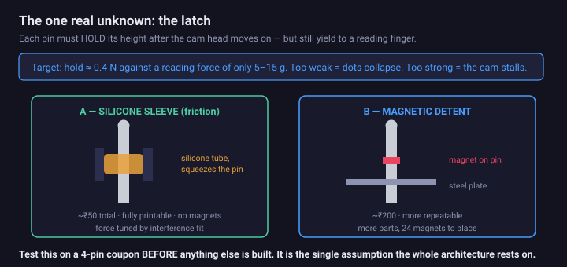

# Getting from one cell to a readable line

**Written 2026-08-19. Architecture study — nothing here is built yet.**

Braillix today is **one cell, 68 mm wide**. A single character at a time.

That is fine for showing how a braille cell works. It is not enough to read a sentence, and it
cannot show a mathematics symbol at all — Nemeth code writes multiplication and division as **two
cells each**, and fractions use opening and closing indicators spanning several cells. Two cells
68 mm apart are not two cells to a reader. They are two separate objects.

This document asks one question: **can Braillix reach a readable line without becoming expensive?**

---

## 1. The wall

Standard braille cells sit **6.1–6.5 mm apart**. That single number decides everything, because
anything placed at *every* cell has to fit inside it.

| Per-cell actuator | Width | Verdict |
|---|---|---|
| Piezo bimorph reed | ~2 mm | fits — and costs ~$100/cell |
| N20 micro gearmotor | 10–12 mm | **1.9× too wide** |
| 28BYJ-48 stepper | 28 mm | 4.5× too wide |
| Braillix cam disc | 44.4 mm | 7.2× too wide |
| Braillix cell today | 68 mm | 11× too wide |

**Only piezo fits — and piezo is precisely why commercial displays cost $4,000 and up.** The cheap
motto and one-actuator-per-cell are in direct conflict. That is not a Braillix problem; it is the
central problem of the whole field.

### Ideas that hit the wall

**Two motors in one cell, two letters.** The 28BYJ-48's shaft is off-centre, so two cans can
interleave — but the motor was never the constraint. Two **cam discs** need about 44 mm between
centres. Still 7× too wide. Costs weeks, does not produce a readable line.

**Eight motors for eight cells.** 8 × ₹150 of motors is affordable. 8 × 68 mm of box is 544 mm.
Geometry kills it, not cost.

**N20 gearmotors.** Smaller and much faster — but still about 2× too wide, and being DC motors they
have no step counting, so each one needs an encoder or hard stops. More parts, more cost, still no.

---

## 2. Two things that *are* worth taking from the brainstorm

**Splitting the cell across two 8-state discs is a genuinely good idea** — just not for scaling.
Three dots per disc means 8 states, 45° per slice, and the cam ramp problem (R-07) disappears:

| states | radius | ramp | pressure angle |
|---|---|---|---|
| 64 (today) | 12.8 mm | 1.1° | **78.5°** — unclimbable |
| 8 | 12.8 mm | 40.5° | **7.9°** — comfortable |

Two things it does **not** do, both counter-intuitive:

- **It does not make refresh faster.** Rotation time depends on the *angle* travelled, not the
  number of states. 180° is 180° whether that is 32 slices or 4.
- **Shrinking the disc does not help the ramp.** At minimum size the dwell arc equals the foot
  width and the pressure angle collapses to `atan(lift x pi / 2 x foot)` = **51.5°**, regardless of
  radius or state count. The disc must be *large relative to its state count*, not small.

---

## 3. The architecture that escapes the wall

Stop giving every cell an actuator. Let **one cam head travel along a line of latching pins**.

Each cell then contains nothing but six 1.7 mm pins. Nothing bulky sits at the cell, so standard
6.2 mm pitch becomes achievable — and **the number of motors stops scaling with the number of
cells**. Four cells need two motors. So do eight. So do twenty.

This is the same family of approach that lets line-at-a-time displays reach far lower per-cell
costs than one-actuator-per-dot designs. Worth researching properly and citing at the panel; do not
quote figures you have not checked yourself.

### The refresh cycle

**A cam can only push.** It cannot pull a latched pin back down. So every refresh is two phases:

1. **Reset** — a bar sweeps the line and pushes every pin flat.
2. **Set** — the head visits each cell, the cam rotates to that character's state, the lifted
   linkages push the required pins up, and the latch holds them.

Once set, the line holds with **zero power**.

### Speed: be honest about this

| | |
|---|---|
| Per cell | ~1.5–2 s, dominated by cam rotation |
| 4 cells | ~8 s |
| 8 cells | ~15 s |

**A leadscrew will not work.** Even at 8 mm/rev, a 28BYJ-48 needs about 16 s just to traverse four
cells. It has to be a **GT2 belt** — a 20-tooth pulley moves 40 mm/rev, roughly 5× faster.

15 s per line is acceptable for a maths line you set once and then read. It is **not** acceptable
for continuous scrolling. Say so plainly rather than letting a panel discover it.

---

## 4. The one real unknown: the latch

Everything else here is ordinary mechanism. The latch is the assumption the architecture rests on.

Each pin must **hold about 0.4 N** so a dot does not collapse, while still yielding to a reading
finger pressing with only 5–15 g. Too weak and the line sags. Too strong and the cam stalls trying
to set it.

| | Cost | Notes |
|---|---|---|
| **Silicone sleeve friction** | ~₹50 | A short length of silicone tube per pin. Fully printable, no magnets. Force tuned by interference fit. **Start here.** |
| **Magnetic detent** | ~₹200 | Small magnet per pin plus a steel plate. More repeatable, but 24 magnets to place and align. |

> ### Test this first, on a 4-pin coupon
> Print four pins, four guides and both latch styles. Load them with a gram scale. Do not design a
> single other part until one of them holds 0.4 N and releases under a fingertip.
> This is a one-evening test that decides whether the next six weeks are worth starting.

---

## 5. What carries over, what is new

**Carries over unchanged** — this is the strongest argument for the approach:

- the 64-state cam encoding and the `DOT_TO_BIT` mapping (`sim/extract_params.py`)
- the cam disc itself (`cad/scad/braille_cam.scad`) — already ordered in resin
- hall-sensor homing, step counting, shortest-path rotation
- the 3D simulator, which can be extended to show the carriage

**New work:**

- GT2 belt, pulleys and a carriage — plus one extra motor
- 24 latching pins at 2.5 mm dot / 6.2 mm cell pitch
- a reset bar and its actuation
- re-converged linkages: the current arms fan out to a 4.8 x 5.2 mm cluster, a standard cell needs
  2.5 x 2.5 mm

---

## 6. Recommendation

**Build the single cell first. Do not abandon it.**

Nothing in this project has ever been physically assembled — no dot has gone up and come back down.
The parts are already paid for and arriving. The single cell is the guaranteed demo, and it settles
**R-07** (whether the cam ramp is climbable at all) before that assumption gets replicated across
24 pins.

Then, and only then:

1. **Latch coupon.** One evening. Decides everything downstream.
2. **Build four cells, not eight.** Half the pins, the same architectural proof — and "it scales by
   lengthening the belt" becomes a demonstrated claim instead of a hope.

### A note for later

If Braillix is ever commercialised rather than submitted, **check patents in this space first**.
There is prior art around micro-motor and cam actuation of braille pins, and at least one
open-source project in India was shut down over it. Irrelevant for academic work. Very relevant the
day it stops being academic.

---

## Sources for the numbers

Every dimension is read from the CAD, not from memory:

| Number | Where from |
|---|---|
| 6.2 mm cell pitch, 2.5 mm dot pitch | braille standard (Library of Congress / Marburg Medium) |
| 44.4 mm cam disc, 68 mm cell | `cad/scad/mech_layout.scad`, `cad/scad/outer_box.scad` |
| pressure angles | computed from `pin_lift`, `track_r`, `angular_ramp_fraction` |
| Nominal 4096 steps/rev, 64 steps/position; owned motor requires Hall-to-Hall calibration | `firmware/breadboard_test/breadboard_test.ino` |
| traverse timings | 28BYJ-48 at 800–1000 steps/s, belt versus leadscrew |
