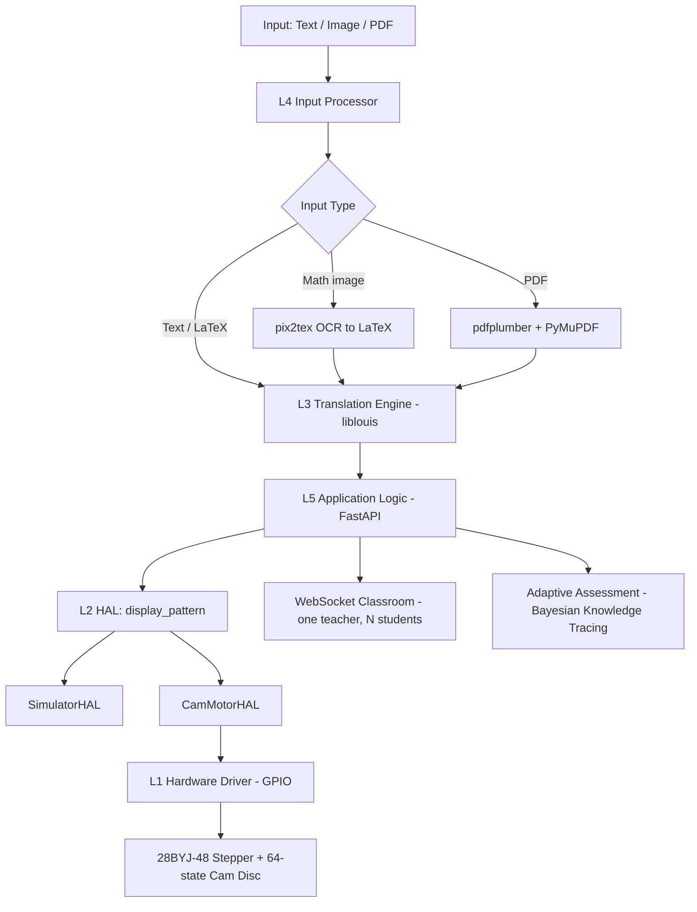

# Braillix — System Architecture

## 1. Overview

Braillix is a low-cost refreshable Braille display and tutoring system for
visually impaired students, with a particular focus on mathematics. The system
converts arbitrary input — typed text, photographed equations, or PDF documents —
into the six-dot Braille cell patterns that drive a physical display, and layers
an adaptive assessment engine on top so the device does not merely *present*
mathematics but actively *teaches* it.

The defining engineering characteristic of the system is a strict six-layer
architecture with explicit, narrow contracts between layers. This separation was
not incidental; it was the decision that allowed a four-person team to develop
hardware and software concurrently and integrate them with minimal friction.

## 2. The Six-Layer Architecture

The system is decomposed into six layers, each owned by a single team member and
communicating only with its immediate neighbours:

| Layer | Responsibility | Owner |
|-------|----------------|-------|
| **L6** Frontend | Teacher/student web interfaces | Harshita |
| **L5** Application logic | FastAPI services, sessions, WebSocket, assessment | Shaurya |
| **L4** Input processor | OCR (pix2tex), PDF extraction, image preprocessing | Shaurya |
| **L3** Translation engine | liblouis: text→Braille, LaTeX→Nemeth | Shaurya |
| **L2** Hardware abstraction (HAL) | `display_pattern(cell_index, dots)` | Aniket |
| **L1** Hardware driver | GPIO, stepper-motor control | Aniket + HW team |

The central architectural principle is that **higher layers never reach past their
immediate neighbour.** Application code (L5) never addresses GPIO (L1); it emits
6-bit dot patterns to the HAL (L2) and is wholly agnostic to whether those patterns
drive a physical cam mechanism or an in-memory simulator. This is the property that
made the project tractable: the software stack was developed and fully tested
against a `SimulatorHAL` long before hardware was available, and the two met at a
single, stable interface.

## 3. Data Flow



A single representation — the **6-bit dot pattern** (an integer in `[0, 63]`, one
per Braille cell) — is the lingua franca that crosses the L3→L5→L2 boundaries. Bit
*i* of the integer corresponds to dot *i+1* of the standard Braille cell. Because
this representation is small, total, and hardware-independent, every layer above
L1 can be reasoned about and tested purely in software.

## 4. The Hardware–Software Contract (L2)

The HAL is the keystone of the design. It exposes three methods:

```python
class BrailleHAL(ABC):
    def display_pattern(self, cell_index: int, dots: int) -> None: ...
    def home(self) -> None: ...
    def get_status(self) -> dict: ...
```

`display_pattern` is *blocking*: it returns only when the dots are physically in
position. This single guarantee lets the application layer treat the display
synchronously and remain ignorant of motor timing, cam geometry, and GPIO. The
contract was frozen early, which decoupled the two halves of the team: the hardware
team could change actuation strategy entirely (the move from six solenoids to a
single cam disc, below) without a single line of application code changing.

## 5. The Cam Mechanism (hardware innovation — Mridul, Atishay)

A conventional refreshable Braille cell uses six independent actuators (one per
dot). At roughly ₹400–500 per actuator, a single cell costs more than the entire
₹3000 target for the device.

The cam mechanism replaces the six actuators of a cell with **one stepper motor
and a 64-state cam disc**. The argument is information-theoretic: a six-dot Braille
cell has exactly 2⁶ = 64 distinct states. A single rotary actuator with 64 encoded
angular positions can therefore realise *every* possible cell pattern, replacing
six binary actuators with one 64-valued one. The software contribution to this is
the cam-angle lookup (L3, `cam_angles.py`): a pure function mapping a 6-bit pattern
to a motor angle, `angle = pattern × (360° / 64) = pattern × 5.625°`. This reduces
per-cell actuator cost by roughly an order of magnitude and is the core reason the
₹3000 price point is achievable.

## 6. Key Design Decisions

| Decision | Alternative considered | Rationale |
|----------|------------------------|-----------|
| **FastAPI** (L5) | Flask | Native `async`/WebSocket support — essential for the real-time classroom — plus automatic OpenAPI documentation and Pydantic request validation. |
| **liblouis** (L3) | Hand-written Nemeth translator | Nemeth mathematical Braille is a large, subtle standard with stateful indicator cells. Reimplementing it would be error-prone and unmaintainable; liblouis is the mature, standard, open-source engine and is explicitly mandated. |
| **pix2tex** (L4) | Training a custom OCR model | A bespoke model needs labelled data we do not have and validation we cannot afford. pix2tex is free, local, and gives LaTeX directly into the liblouis pipeline. |
| **Bayesian Knowledge Tracing** (L5) | Simple running accuracy (% correct) | Raw accuracy cannot distinguish a lucky guess from genuine mastery, nor a careless slip from non-understanding. BKT models latent knowledge probabilistically and is explainable to evaluators (see `ml-methodology.md`). |
| **Cam disc** (L1) | Six solenoids per cell | 2⁶ = 64 states ⇒ one 64-position rotary actuator suffices; ~10× cheaper per cell. |
| **In-memory session state** (L5) | Redis | At demo scale (5–10 devices) an in-process dictionary is sufficient and removes an operational dependency. |
| **SimulatorHAL-first development** | Wait for hardware | Allowed the entire software stack to be built and tested (500+ automated tests) before hardware existed, and provides a live fallback if hardware fails during the demonstration. |

## 7. Testing and Verifiability

The architecture is validated by an automated test suite (500+ tests, green on a
Linux CI runner with real liblouis). Each layer is tested in isolation — the
translation engine against known Braille outputs, the OCR service against mocked
pix2tex, the assessment engine against hand-verified Bayesian updates — and the
layers are tested together through the FastAPI application using an in-process
client. Because no test depends on physical hardware, the suite runs on any
machine, which is itself a consequence of the layered design.
